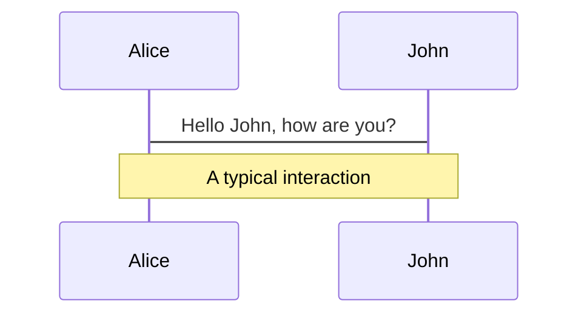
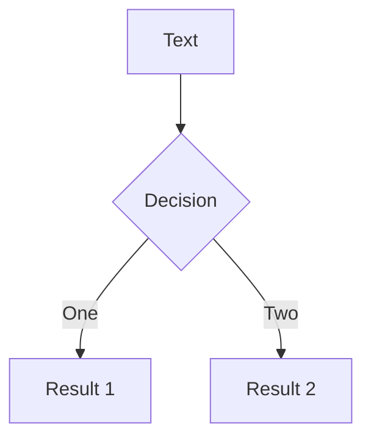
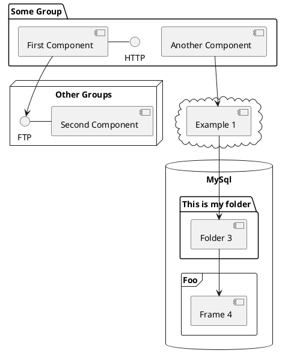

---
# try also 'default' to start simple
theme: seriph
# random image from a curated Unsplash collection by Anthony
# like them? see https://unsplash.com/collections/94734566/slidev
background: https://source.unsplash.com/collection/94734566/1920x1080
# apply any windi css classes to the current slide
class: "text-center"
# https://sli.dev/custom/highlighters.html
highlighter: shiki
# show line numbers in code blocks
lineNumbers: false
# some information about the slides, markdown enabled
info: |
  ## Slidev Starter Template
  Presentation slides for developers.

  Learn more at [Sli.dev](https://sli.dev)
# persist drawings in exports and build
drawings:
  persist: false
# use UnoCSS (experimental)
css: unocss
---

# Gaming Industry

The Chronicles

A brief view about the modern gaming industry

---

# When was video gaming born?

<div grid="~ cols-2 gap-10" m="-t-2">

- Around 1950 and 1960.
- Ping-pong and Spacewar were the first video games.


</div>

<style>
h1 {
  background-color: #2B90B6;
  background-image: linear-gradient(45deg, #4EC5D4 10%, #146b8c 20%);
  background-size: 100%;
  -webkit-background-clip: text;
  -moz-background-clip: text;
  -webkit-text-fill-color: transparent;
  -moz-text-fill-color: transparent;
}
</style>

---

# Video game consoles

Two types of video game consoles

| **Home consoles**                | **Handheld consoles**  |
| -------------------------------- | ---------------------- |
| PlayStation 1-2-3-4-5            | PlayStation Portable   |
| Xbox 360, Xbox One               | PlayStation Vita       |
| Sega Genesis                     | GameBoy                |
| NES, SNES, GameCube, Wii, Switch | Nintendo DS            |
| GameCube                         | Nintendo 3DS           |
| Switch                           | Switch (Handheld mode) |

---

# Video game consoles (2)

Game console generations:

- _First (1972 - 1980)_: Magnavox, Pong
- _Second (1976 - 1992)_: Atari 2600, Mattel Intellivision
- _Third (1983 - 2003)_: Sega Master System, Atari 7800, Nintendo Entertainment System (NES)
- _Fourth (1987 - 2004)_: Sga Genesis, SNK Neo Geo, Super Nintendo Entertainment System (SNES)
- _Fifth (1993 - 2006)_: Sega Saturn, PlayStation 1 (PSX), Nintendo 64
- _Sixth (1998 - 2013)_: Sega Dreamcast, PlayStation 2, Nintendo GameCube, Microsoft Xbox
- _Seventh (2005 - 2017)_: Microsoft Xbox 360, PlayStation 3, Nintendo Wii
- _Eighth (2012 - present)_: Nintendo WiiU, PlayStation 4, Xbox One, Nintendo Switch
- _Ninth (2020 - present)_: Xbox Series X/S, PlayStation 5

_=> There are intersections between generations._

---

# PC gaming

PC gaming is:

- Usually cheaper, more versatile
- Fragmented between publishers, platforms and operating systems.
- Mostly on Windows

---

# PC gaming (2)

PC gaming is not owned by anyone or any company. Major platforms:

- Steam (Valve)
- Origin (EA)
- PC Game Pass (Microsoft)
- UPlay (Ubisoft)
- Battle.net (Blizzard)
- Epic Store (Epic Games)

---

# Mobile gaming

TBD

---

# Components

<div grid="~ cols-2 gap-4">
<div>

You can use Vue components directly inside your slides.

We have provided a few built-in components like `<Tweet/>` and `<Youtube/>` that you can use directly. And adding your custom components is also super easy.

```html
<Counter :count="10" />
```

<!-- ./components/Counter.vue -->
<Counter :count="10" m="t-4" />

Check out [the guides](https://sli.dev/builtin/components.html) for more.

</div>
<div>

```html
<Tweet id="1390115482657726468" />
```

<Tweet id="1390115482657726468" scale="0.65" />

</div>
</div>

---

## class: px-20

# Themes

Slidev comes with powerful theming support. Themes can provide styles, layouts, components, or even configurations for tools. Switching between themes by just **one edit** in your frontmatter:

<div grid="~ cols-2 gap-2" m="-t-2">

```yaml
---
theme: default
---
```

```yaml
---
theme: seriph
---
```


</div>

Read more about [How to use a theme](https://sli.dev/themes/use.html) and
check out the [Awesome Themes Gallery](https://sli.dev/themes/gallery.html).

---

## preload: false

# Animations

Animations are powered by [@vueuse/motion](https://motion.vueuse.org/).

```html
<div v-motion :initial="{ x: -80 }" :enter="{ x: 0 }">Slidev</div>
```

<div class="w-60 relative mt-6">
  <div class="relative w-40 h-40">
    
    
    
  </div>

  <div
    class="text-5xl absolute top-14 left-40 text-[#2B90B6] -z-1"
    v-motion
    :initial="{ x: -80, opacity: 0}"
    :enter="{ x: 0, opacity: 1, transition: { delay: 2000, duration: 1000 } }">
    Slidev
  </div>
</div>

<!-- vue script setup scripts can be directly used in markdown, and will only affects current page -->
<script setup lang="ts">
const final = {
  x: 0,
  y: 0,
  rotate: 0,
  scale: 1,
  transition: {
    type: 'spring',
    damping: 10,
    stiffness: 20,
    mass: 2
  }
}
</script>

<div
  v-motion
  :initial="{ x:35, y: 40, opacity: 0}"
  :enter="{ y: 0, opacity: 1, transition: { delay: 3500 } }">

[Learn More](https://sli.dev/guide/animations.html#motion)

</div>

---

# LaTeX

LaTeX is supported out-of-box powered by [KaTeX](https://katex.org/).

<br>

Inline $\sqrt{3x-1}+(1+x)^2$

Block

$$
\begin{array}{c}

\nabla \times \vec{\mathbf{B}} -\, \frac1c\, \frac{\partial\vec{\mathbf{E}}}{\partial t} &
= \frac{4\pi}{c}\vec{\mathbf{j}}    \nabla \cdot \vec{\mathbf{E}} & = 4 \pi \rho \\

\nabla \times \vec{\mathbf{E}}\, +\, \frac1c\, \frac{\partial\vec{\mathbf{B}}}{\partial t} & = \vec{\mathbf{0}} \\

\nabla \cdot \vec{\mathbf{B}} & = 0

\end{array}
$$

<br>

[Learn more](https://sli.dev/guide/syntax#latex)

---

# Diagrams

You can create diagrams / graphs from textual descriptions, directly in your Markdown.

<div class="grid grid-cols-3 gap-10 pt-4 -mb-6">







</div>

[Learn More](https://sli.dev/guide/syntax.html#diagrams)

---

layout: center
class: text-center

---

# Learn More

[Documentations](https://sli.dev) · [GitHub](https://github.com/slidevjs/slidev) · [Showcases](https://sli.dev/showcases.html)
